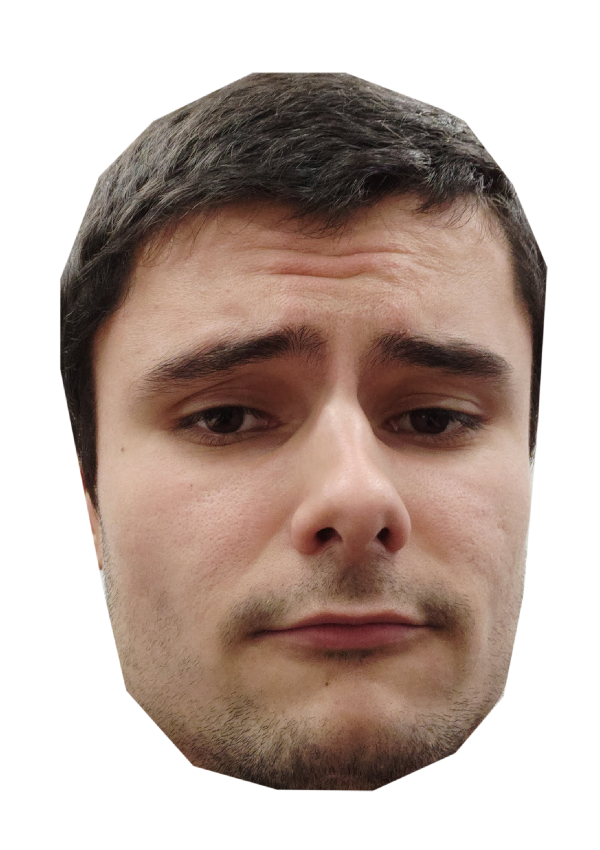
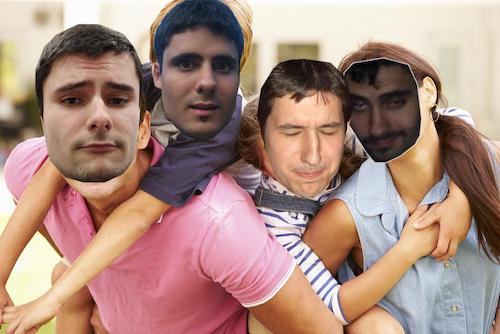

# Gimpify

This repository is intended for creating, editing and sending nightmares in the form of
image montages with a Telegram bot. Just put the background images you want to edit, faces you want 
to paste into the background image, and just ask the bot for /tothemoon. 

The bot will send you a message with the created montage. The background assignation and the
face pasted are chosen randomly, so each time you ask for /tothemoon, you will get a different 
montage.

## Installation
### modules
(The use of virtual environment is recommended)
```bash
pip3 install requirements.txt
```

### Telegram Bot
First, you need to talk to the BotFather in Telegram and create a Bot. He (or she) will give you a
token, which you need to put into "src/bot/auth.py" as follows:

```python
token = "1234567890:asfdsff-XXXXXXXXXXXXXXXXXXXXXX"
```

And that's pretty much it for the installation.

## How to run?
First, you will need to populate the folder "resources/in/faces" with faces 
and "resources/in/backgrounds" with backgrounds.

### Faces
Must be png and cropped. If the face is not being recognized, try to add a little bit of space
between the face and the frame, usually works. You will know that the face xxx.png is not being
recognized because an error message will be thrown into the terminal. The code will continue 
though.

### Backgrounds
You can put any background as long as it contains faces. Preferably png (as they will get 
converted to png if not) and with faces facing the image to get the best results.

## Examples
### face


### backgroung IN


### Montage out
